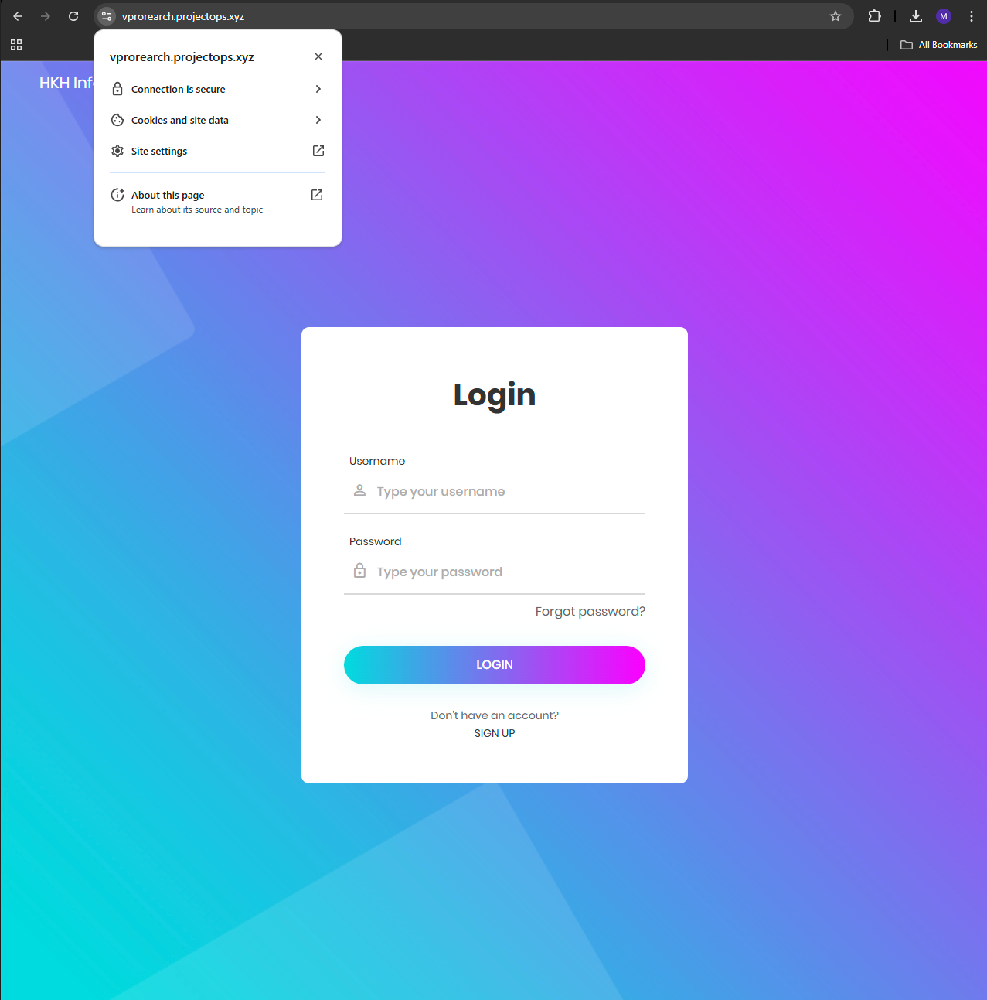
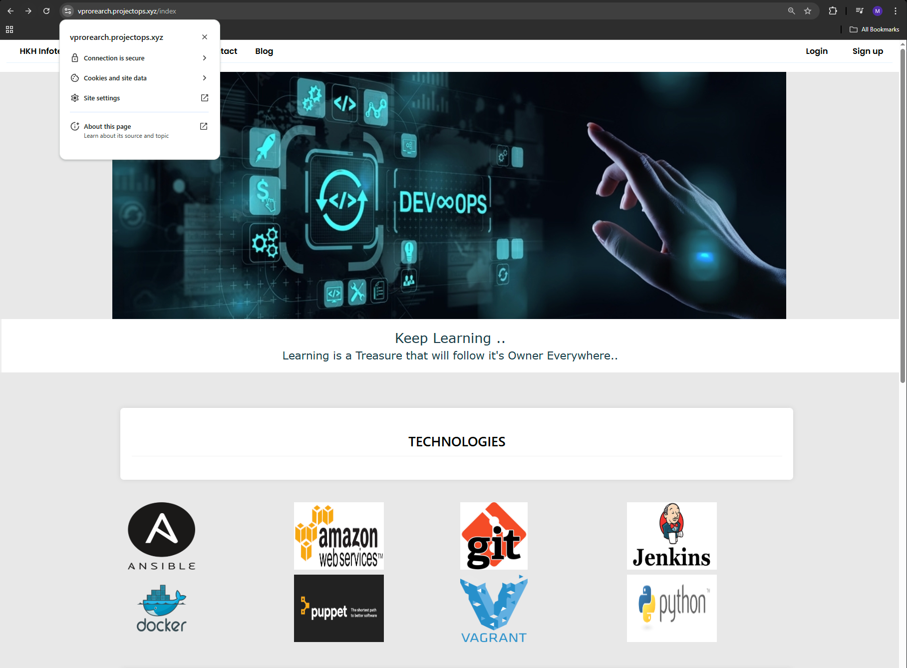

# 🚀 Re-Architecting vProfile Application on AWS (PaaS & SaaS)

## 🌟 Project Overview
This project demonstrates how I re-architected a **multi-tier Java application (vProfile)** on AWS using **cloud-native managed services (PaaS & SaaS)**.

Unlike a traditional **Lift-and-Shift migration** (EC2-heavy, ops-driven), this solution leverages **AWS-managed offerings** to achieve:
- ✅ **Scalability** (Elastic Beanstalk + Auto Scaling)
- ✅ **Security** (Private RDS, IAM roles, ACM SSL, Security Groups)
- ✅ **Global Reach** (CloudFront CDN)
- ✅ **Performance** (ElastiCache caching layer)
- ✅ **Automation** (Infrastructure-as-Code friendly, CI/CD ready)
- ✅ **Cost Efficiency** (Pay-as-you-go model, reduced ops overhead)

---

## 🏗 Architecture Diagram

### 🔹 Final AWS Services Used
- **Elastic Beanstalk** → Runs Tomcat app, manages ALB, Auto Scaling, EC2, S3 artifacts.
- **Amazon RDS (MySQL 8.0)** → Managed relational database with automated backups.
- **Amazon ElastiCache (Memcached 1.6)** → In-memory caching layer to reduce DB load.
- **Amazon MQ (RabbitMQ)** → Managed messaging broker for asynchronous communication.
- **Amazon S3** → Stores build artifacts for deployment.
- **Amazon CloudFront** → CDN for global delivery with HTTPS support.
- **Amazon Route 53** → DNS routing with custom domain integration.
- **Amazon CloudWatch** → Monitoring, alarms, auto scaling triggers.
- **AWS IAM** → Roles & policies for secure service interactions.
- **AWS Certificate Manager (ACM)** → Free SSL certificate for HTTPS.

---

## ⚙️ Implementation Steps

1. **Backend Setup**
    - Created RDS, ElastiCache, and Amazon MQ inside a private VPC.
    - Configured a backend **Security Group** allowing internal service-to-service comms.

2. **Database Initialization**
    - Launched temporary EC2 (MySQL client).
    - Cloned repo & applied `db_backup.sql` to RDS `accounts` DB.
    - Terminated EC2 after initialization.

3. **Elastic Beanstalk Setup**
    - Created IAM roles for Beanstalk.
    - Launched Tomcat (Corretto 21) environment with ALB + Auto Scaling.
    - Configured health checks (`/login`) and stickiness for sessions.

4. **Build & Deploy Artifact**
    - Updated `application.properties` with RDS, MQ, ElastiCache endpoints.
    - Built WAR using Maven → `vprofile-v2.war`.
    - Deployed via Beanstalk with **Rolling Deployment (50%)**.

5. **Secure HTTPS + Domain**
    - Integrated ACM SSL certificate with ALB listener (port 443).
    - Mapped custom domain (`vprorearch.mydomain.com`) via Route 53/GoDaddy.

6. **Global Distribution**
    - Created CloudFront distribution with Beanstalk ALB as origin.
    - Linked ACM certificate for HTTPS.
    - Updated DNS CNAME → CloudFront distribution.
    - Validated requests served from nearest edge location.

---

## ✅ Key Features
- **Decoupled architecture** using AWS managed services.
- **Zero/minimal downtime deployments** with Beanstalk rolling updates.
- **Scalable & fault tolerant** (Auto Scaling + CloudFront).
- **Secure** (HTTPS with ACM, private subnets, IAM roles).
- **Global performance optimization** with CloudFront CDN.
- **Ops-friendly** → fully CI/CD and IaC ready.

---

## 📊 Before vs After

| Component         | Old (Lift-and-Shift) | New (Re-Architected) |
|-------------------|----------------------|----------------------|
| Application Server| Tomcat on EC2        | Elastic Beanstalk    |
| Database          | MySQL on EC2         | Amazon RDS           |
| Cache             | Memcached on EC2     | ElastiCache          |
| Messaging Queue   | RabbitMQ on EC2      | Amazon MQ            |
| Load Balancer     | Manual ALB setup     | Managed by Beanstalk |
| CDN               | ❌ Not used           | ✅ CloudFront        |
| SSL/TLS           | Manual via certs     | ACM Managed          |

---

## 🧑‍💻 Skills Demonstrated
- **AWS Cloud Architecture** (PaaS/SaaS migration, multi-tier apps)
- **DevOps Practices** (CI/CD, IaC-ready design, automation-friendly)
- **Application Deployment** (Elastic Beanstalk, Maven build pipelines)
- **Networking & Security** (VPC, SGs, IAM, ACM SSL)
- **Monitoring & Scaling** (CloudWatch metrics, auto scaling policies)
- **Global Performance** (CloudFront CDN, caching strategy)

---

## 🧹 Cleanup
To avoid AWS charges, all resources were deleted:
- CloudFront distribution, RDS, ElastiCache, MQ.
- Beanstalk environment (EC2, ALB, ASG).
- Security Groups & DNS records.
- ACM SSL certificates if no longer needed.

---

## 🏆 Final Takeaway
This project showcases my ability to **re-architect a traditional application into a cloud-native design** using AWS services, enabling:
- **High availability**
- **Scalability**
- **Performance optimization**
- **Security**
- **Automation**

This is exactly the type of modernization strategy companies adopt when migrating legacy applications to the cloud.

---
## 🌐 Final View

